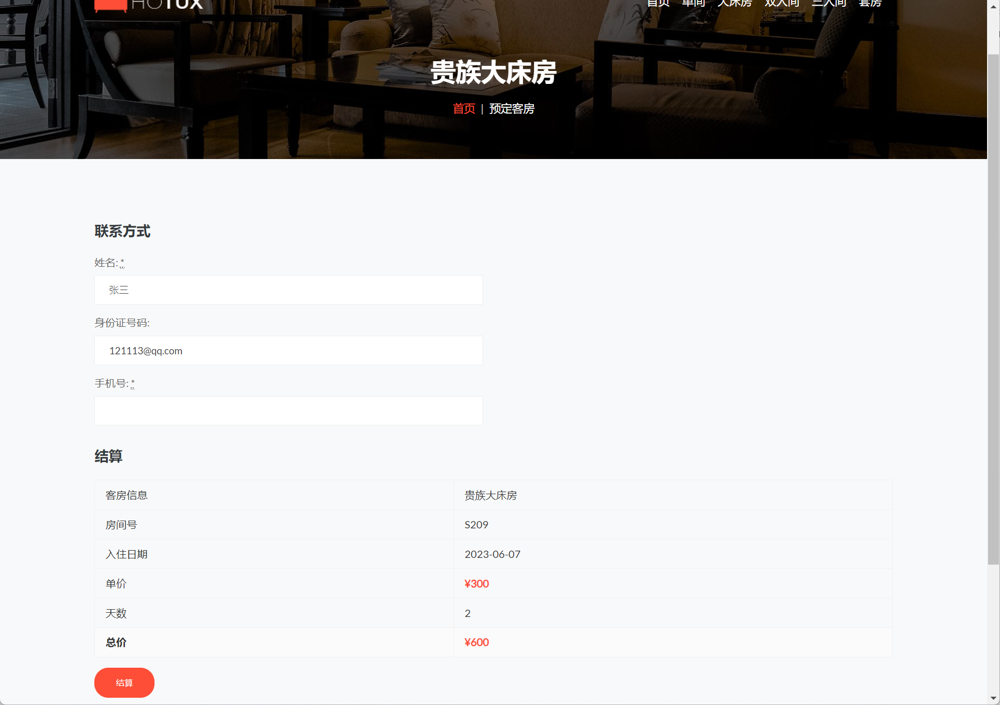

### 作者QQ：1556708905(支持修改、 部署调试、 支持代做毕设)

#### 支持代做任何毕设论、接网站建设、小程序、H5、APP、各种系统等

**毕业设计所有选题地址 [https://github.com/zhengjianzhong0107/allProject](https://github.com/zhengjianzhong0107/allProject)**

**[博客地址](https://blog.csdn.net/2303_76227485/article/details/131073480)**

**视频演示：
[B站视频演示](https://www.bilibili.com/video/BV1wk4y1T7Ea/)**

 

## 基于springboot的酒店管理系统(源代码+数据库)074

## 一、系统介绍

本系统包括三种角色：管理员、客户、酒店工作人员。

1、管理员功能：财务管理（营销统计）、客房管理、客房类型管理、客户管理、工作人员管理、订单管理、角色管理、菜单权限管理
2、客户功能：注册、登录、客房浏览查询、预定客房、查看自己订单列表、个人信息修改、密码修改
3、酒店工作人员功能：客房浏览查询、订单管理、客户管理、财务管理

## 二、所用技术

后端技术栈：

- springboot
- mybatis
- mysql
- Shiro

前端技术栈：

- html
- Bootstrap
- jQuery
- ajax

## 三、环境介绍

基础环境 :IDEA/eclipse, JDK 1.8, Mysql5.7及以上,Maven3.6

所有项目以及源代码本人均调试运行无问题 可支持远程调试运行

## 四、页面截图

## 五、浏览地址

前台访问地址：http://localhost:8074/

-用户账号/密码：zhangsan/123456
-工作人员账号/密码：admin/123456
-管理员账号/密码：zhouyu/123456

## 六、部署教程

1. 使用Navicat或者其它工具，在mysql中创建对应名称的数据库，并执行hotux.sql文件的sql；

2. 使用IDEA/Eclipse导入hotel-master项目，若为maven项目请选择maven，等待依赖下载完成；

3. 进入src/main/resources修改application.yml 里面的数据库配置

4. 启动项目后端项目

 
